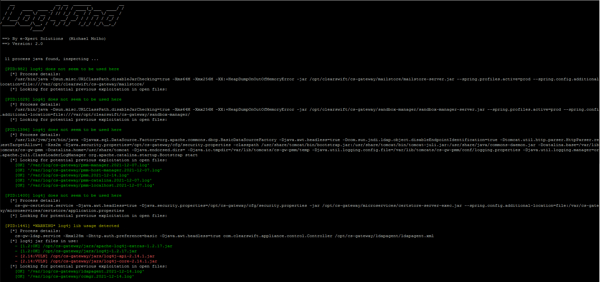

## Requirements

- Run on potentially any Linux based system
- Tested successfully on Ubuntu, Centos, Redhat, OpenSUSE and various Linux appliances (Checkpoint, Tufin, F5, ClearSwift, Totemo ...)

## Usage

`$ chmod +x log4find.sh`

`$ ./log4find.sh`

- Lines in green mean: *"nothing special here"*
- Lines in yellow mean: *"pay attention, you should have a deeper look here"*
- Lines in red mean: *"there is a good chance this machine is at risk or even compromised !"*

