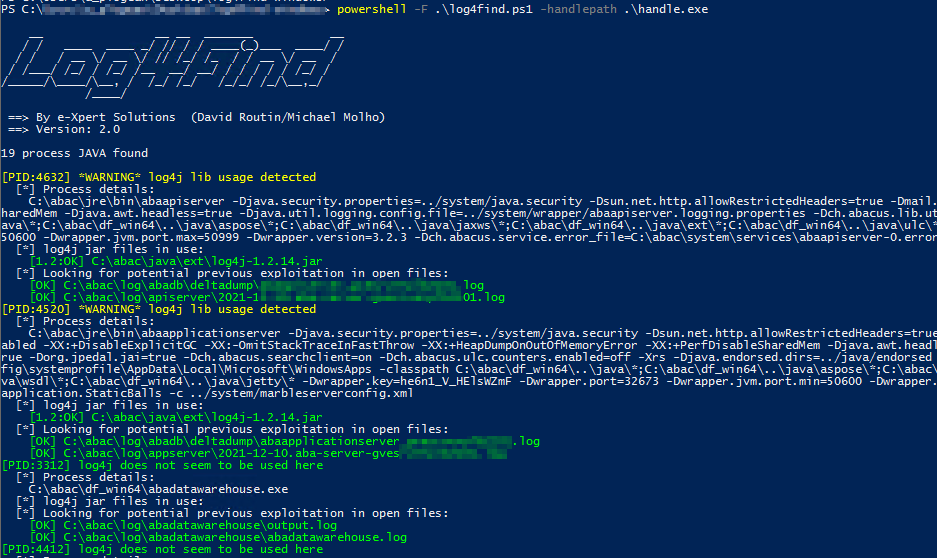

## Requirements

 - Run on potentially any Windows based system with Powershell available
 - Tested successfully on Windows 2012 Server and Windows 2016
 - Administrator rights
 - Download of "handle.exe" from Microsoft Sysinternals ([Handle - Windows Sysinternals | Microsoft Docs])(https://docs.microsoft.com/en-us/sysinternals/downloads/handle)
  

## Simple usage: local execution

**Before anything**: the file "handle.exe" from Microsoft Sysinternals must be downloaded [here](https://docs.microsoft.com/en-us/sysinternals/downloads/handle)

Local usage from a CMD shell as Administrator (default)

`powershell -ExecutionPolicy Bypass -File log4find.ps1 -HandlePath <handle.exe_filepath>`

By default, the script script will try to auto detect running Java processes. Sometimes it might miss them when the java.exe binary has been renamed. 

**If you think Log4Find has missed a running Java process, you can restart it with the option -AllProcess (longer execution time) :**

`powershell -ExecutionPolicy Bypass -File log4find.ps1 -HandlePath <handle.exe_filepath> -AllProcess`

## Advanced usage: GPO deployment and central logging

Another option is to schedule the deployment and execution of this script through all your Windows domain through GPO and collect all the outputs to a central logs directory. 

**Please note that in that configuration, the script will check if the output file exists already. If yes, the script will not run a second time. To force it to run again, make sure to delete or remove the output file of the machine in the centralized logs folder.**

To do that, the file "handle.exe" must be available for all the machines. 

You can host that file in a **READ ONLY** file share accessible to all machines : \\\READ_ONLY_SHARE\handle.exe. 

You need to make sure this shared folder is **READ ONLY** and allowed for both groups "Domain Users" and "Domain Computers" (both on network share and file system security properties). 

**Pay attention to the fact that this file share must be READ ONLY ! Allowing write access to this share by mistake represents a high security risk as it may allow any attacker to modify this file and run arbitrary command as SYSTEM on all your environment.**

In addition, you need a another **WRITABLE** shared folder to receive all the outputs of the script executed by all the machines. 

Once you have these two shared folders, you can test it works as expected on a single machine with this command :

`powershell -ExecutionPolicy Bypass -File log4find.ps1 -HandlePath "\\READ_ONLY_SHARE\handle.exe" -LoggingDir "\\WRITABLE_SHARE\"`

If working as expected, you should get a logging file ${hostname}.log in the folder \\\WRITABLE_SHARE

Then you can configure the GPO to schedule immediate execution of the script to all machines through GPO

### GPO Configuration

The easiest deployment process can be performed using Scheduled Task (GPO). For this you can follow the procedure below (extracted from https://docs.microsoft.com/en-us/microsoft-365/security/defender-endpoint/configure-endpoints-gp?view=o365-worldwide and modified)

1.  **Copy "log4find.ps1" in the READ ONLY share** you created at first : \\\READ_ONLY_SHARE\log4find.ps1
2. To create a new GPO, open the  [Group Policy Management Console](https://docs.microsoft.com/en-us/internet-explorer/ie11-deploy-guide/group-policy-and-group-policy-mgmt-console-ie11)  (GPMC), right-click  **Group Policy Objects**  you want to configure and click  **New**. Enter the name of the new GPO in the dialogue box that is displayed and click  **OK**.
	
3.  Open the  [Group Policy Management Console](https://docs.microsoft.com/en-us/internet-explorer/ie11-deploy-guide/group-policy-and-group-policy-mgmt-console-ie11)  (GPMC), right-click the Group Policy Object (GPO) you want to configure and click  **Edit**.
	
4.  In the  **Group Policy Management Editor**, go to  **Computer configuration**, then  **Preferences**, and then  **Control panel settings**.
	
5.  Right-click  **Scheduled tasks**, point to  **New**, and then click  **Immediate Task (At least Windows 7)**.
	
6.  In the  **Task**  window that opens, go to the  **General**  tab. Under  **Security options**  click  **Change User or Group**  and type SYSTEM and then click  **Check Names**  then  **OK**. NT AUTHORITY\SYSTEM appears as the user account the task will run as.
	
7.  Select  **Run whether user is logged on or not**  and check the  **Run with highest privileges**  check box.
	
8.  In the Name field, type an appropriate name for the scheduled task (for example, **Log4find 2.0**).
	
9.  Go to the  **Actions**  tab and select  **New...**  Ensure that  **Start a program**  is selected in the  **Action**  field. Enter the following in the  

 "Program/script:" 

	powershell.exe 

 "Add arguments:" 

	-ExecutionPolicy Bypass -File \\READ_ONLY_SHARE\log4find.ps1 -HandlePath \\READ_ONLY_SHARE\handle.exe -LoggingDir \\WRITABLE_SHARE\

	
11.  Select  **OK**  and close any open GPMC windows.
	
12.  To link the GPO to an Organization Unit (OU), right-click and select  **Link an existing GPO**. In the dialogue box that is displayed, select the Group Policy Object that you wish to link. Click  **OK**.

